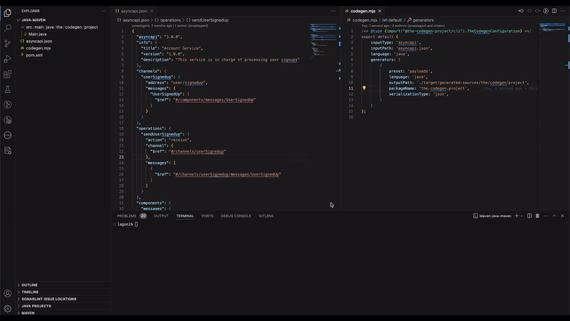
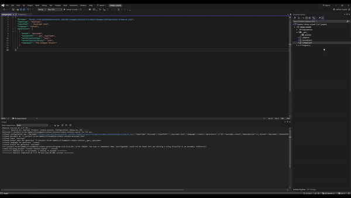

<div align="center">

<h1>⚡️The Codegen project</h1>

[](https://github.com/the-codegen-project/cli/blob/master/LICENSE)
[](https://www.npmjs.com/package/@the-codegen-project/cli)


)
)


<h4>Generate payload models, parameter, headers, messages, communication support functions, testing functions and more, across programming languages such as TypeScript, C#, Java, and more...</h4>

[Read the Docs](./docs/) | [View Demos](./examples/)

</div>

<table>
  <tr>
    <td style="width:50%">
      <div style="text-align: center;">

<a href="https://github.com/the-codegen-project/cli/tree/main/examples/csharp-console">TypeScript library</a>

[](./assets/videos/generate-typescript.gif)
      </div>
    </td>
    <td>
      <div style="text-align: center;">

<a href="https://github.com/the-codegen-project/cli/tree/main/examples/java-maven">Java Maven</a>

[](./assets/videos/generate-maven.gif)
      </div>
    </td>
  </tr>
  <tr>
    <td>
      <div style="text-align: center;">

<a href="https://github.com/the-codegen-project/cli/tree/main/examples/typescript-nextjs">TypeScript Next.JS</a>

[](./assets/videos/generate-nextjs.gif)
      </div>
    </td>
    <td>
      <div style="text-align: center;">

<a href="https://github.com/the-codegen-project/cli/tree/main/examples/csharp-console">C# Console Application</a>

[](./assets/videos/generate-csharp.gif)
      </div>
    </td>
  </tr>
</table>

# Core Features
- 📃 Generate payload representations from your AsyncAPI document (including Protobuf, RAML, OpenAPI Schema) (example)
- 📊 Customize the generators output to your hearts desire (demo)
- 💫 Regenerate once the input changes (demo)
- 👀 Integrate it into any project (such as [Next.JS](./examples/typescript-nextjs/), [Maven](./examples/java-maven/), [Gradle](./examples/java-gradle/), [C# console application](./examples/csharp-console/), etc.)
- 💅 Create custom generators ([read more](./docs/generators/custom.md))
- 🗄️ Protocol agnostic generator (demo)
- ⭐ And much more...

# How it works
The Codegen Project is a generator that is built to live along side your projects to help you save time in the development phase, ensuring you spend as much time on the business logic as possible. It works by using your configuration file to know what it needs to generate. 

Each input has different generates and all of them can be customized, or you can build your own generator [right in the configuration file](./docs/generators/custom.md).
```ts
export default {
	inputType: 'asyncapi',
	inputPath: './asyncapi.json',
	language: 'typescript',
	generators: [
		{
			preset: 'payloads',
			outputPath: './src/payloads',
			serializationType: 'json', 
		},
    ...
	]
};
```

In this example, the generator will read the AsyncAPI document located in same directory as the configuration file, and generate TypeScript models for all the payload including code to serialize the models to JSON.

# Getting started
Its simple, [install the CLI](#install) into your project or machine, [setup the Codegen configuration file](#initialize) to include all the code your heart desire, customize it, and generate it at build time or whenever you feel like it.

## Install
Installing the CLI can be done inside a project or within your system.

<table style="table-layout: fixed;">
  <tr style="height: 50px;">
    <th>Package manager</th>
    <th>MacOS x64</th>
    <th>MacOS arm64</th>
    <th>Windows x64</th>
    <th>Windows x32</th>
    <th>Linux (Debian)</th>
    <th>Linux (Others)</th>
  </tr>
  <tr>
    <td style="vertical-align: top; min-width: 300px;">
      <div>

#### NPM

```sh
npm install --save-dev @the-codegen-project/cli

npm install -g @the-codegen-project/cli
```

#### Yarn

```sh
yarn add @the-codegen-project/cli
```

#### Pnpm

```sh
pnpm add @the-codegen-project/cli
```

#### Bun

```sh
bun add @the-codegen-project/cli
```

</div>
    </td>
    <td style="vertical-align: top;">
      <div>

#### Download
```sh
curl -OL https://github.com/the-codegen-project/cli/releases/latest/download/codegen.x64.pkg
```

#### Install
```sh
sudo installer -pkg codegen.x64.pkg -target /
```

</div>
    </td>
    <td style="vertical-align: top;">
      <div>

#### Download
```sh
curl -OL https://github.com/the-codegen-project/cli/releases/latest/download/codegen.arm64.pkg
```
#### Install

```sh
sudo installer -pkg codegen.arm64.pkg -target /
```
</div>
    </td>
    <td style="vertical-align: top;">
      <div>
<a href="https://github.com/the-codegen-project/cli/releases/latest/download/codegen.x64.exe">Download and run codegen.x64.exe</a>
</div>
    </td>
    <td style="vertical-align: top;">
      <div>
<a href="https://github.com/the-codegen-project/cli/releases/latest/download/codegen.x86.exe">Download and run codegen.x86.exe</a>
</div>
    </td>
    <td style="vertical-align: top;">
      <div>

#### Download
```sh
curl -OL https://github.com/the-codegen-project/cli/releases/latest/download/codegen.deb
```

#### Install
```sh
sudo apt install ./codegen.deb
```
</div>
    </td>
    <td style="vertical-align: top;">
      <div>

#### Download
```sh
curl -OL https://github.com/the-codegen-project/cli/releases/latest/download/codegen.tar.gz
```

#### Install

```sh
tar -xzf codegen.tar.gz
```

#### Symlink
```sh
ln -s <absolute-path>/bin/codegen /usr/local/bin/codegen
```

</div>
    </td>
  </tr>
</table>

You can find all the possible commands in [the usage documentation](./docs/usage.md).

## Initialize
Add a configuration file, either manually or through the CLI;
```sh
codegen init
```

<div align="center">


[](./assets/videos/initialize.webm)

[Customize it to your heart's desire!](./docs/generators/)

</div>

## Generate
With your configuration file in hand, time to generate the code and use it! This can be done manually or integrate into your build process. Checkout [all the examples](./examples/) for inspiration how to do it.

```sh
codegen generate
```
