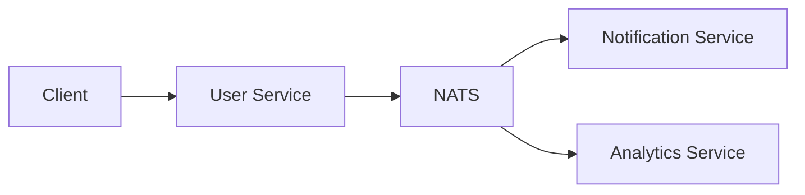

## Overview

The User Service is responsible for all user-related operations in the platform. It publishes events when users perform actions like signing up, updating their profile, or changing their preferences.

## Architecture



## Events Published

| Event | Description |
|-------|-------------|
| UserSignedUp | Published when a new user registers |

## Getting Started

```bash
# Install dependencies
npm install

# Start the service
npm run start
```

## Configuration

| Variable | Description | Default |
|----------|-------------|---------|
| `NATS_URL` | NATS server URL | `nats://localhost:4222` |
| `DATABASE_URL` | PostgreSQL connection string | - |
