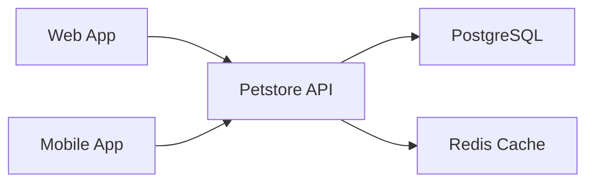

## Overview

The Petstore API provides RESTful endpoints for managing pets, orders, and users in the pet store application. It's the main interface for all client applications.

## Architecture



## Endpoints

| Method | Path | Description |
|--------|------|-------------|
| POST | /pet | Add a new pet |
| PUT | /pet | Update an existing pet |
| GET | /pet/findByStatus/{status}/{categoryId} | Find pets by status and category |

## Authentication

The API supports two authentication methods:

1. **OAuth2** - For user-facing applications
2. **API Key** - For service-to-service communication

## Getting Started

```bash
# Using the generated client
import { PetstoreClient } from './src/client';

const client = new PetstoreClient({
  baseUrl: 'https://api.petstore.com',
  apiKey: 'your-api-key',
});

const pets = await client.findPetsByStatusAndCategory({
  status: 'available',
  categoryId: 1,
});
```

## Rate Limits

| Tier | Requests/min | Requests/day |
|------|--------------|--------------|
| Free | 60 | 1,000 |
| Pro | 600 | 50,000 |
| Enterprise | Unlimited | Unlimited |
